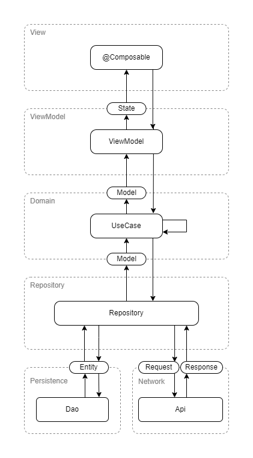

# ArchUnit Android Example
This repository is a project that is designed to show off how ArchUnit can be used in an Android project to enforce architectural rules.

## Application
The application is a simple application that displays lists of numbers, and some information about these numbers.

### Architecture

## Rules
This project is designed to have a layered architecture with the following rules: 

### Persistence Layer
The Persistence layer should contain objects named "Dao" and "Entity"
The Persistence layer manages the storage and retrieval of locally persisted data

Dao objects are the interface to the Persistence layer
Dao methods must be suspending, or return Flows
Dao methods must return Entities

The Persistence layer should not depend on any other layer
The Persistence layer should live in the `com.isaacudy.archunit.example.data` package

### Network Layer
The Network layer should contain objects named "Api", "Request", and "Response"
The Network layer manages the storage and retrieval of data over the Network

Api objects are the interface to the Network layer
Api methods should be suspending
Api methods should take Request objects as parameters
Api methods should return Response objects

The Network layer should not depend on any other layer
The Network layer should live in the `com.isaacudy.archunit.example.data` package

### Repository Layer
The Repository layer is made up of objects named "Repository" 
The Repository layer is a bridge between the Domain layer and the Network/Persistence layer

Repository objects may depend on Api objects
Repository objects may depend on Dao objects
Repository objects must not depend on other Repository objects
Repository objects must return Model objects (which belong to the Domain layer)
Repository object functions must be suspending, or return Flows

The Repository layer can depend on the Network layer, Persistence layer and models from the Domain layer
The Repository layer should live in the `com.isaacudy.archunit.example.data` package

### Domain Layer
The Domain layer is made up of objects named "Model" and "UseCase"
UseCase objects must contain only one public function
UseCase objects may depend on other UseCase objects
UseCase objects may depend on Repository objects
UseCase functions must be suspending, or return Flows

Unlike other layers, Model objects and UseCase objects are not required to be suffixed with "Model" or "UseCase" (although they may be)

The Domain layer can depend on the Repository layer
The Domain layer should live in the `com.isaacudy.archunit.example.domain` package

### ViewModel Layer
The ViewModel layer should contain objects named "ViewModel" and "State"
ViewModel objects should expose a single StateFlow containing a State
ViewModel objects should expose methods which return Unit, but no other types

The ViewModel layer can depend on the Domain layer
The ViewModel layer should live in the `com.isaacudy.archunit.example.feature` package

### View Layer
The View layer should contain Composable functions that consume ViewModels and State objects

The View layer can depend on the ViewModel layer
The View layer should live in the `com.isaacudy.archunit.example.feature` package

Note: The View layer rules are not enforced with ArchUnit at this stage 

## Notes
The architecture described in this project is not being described as an ideal architecture for Android projects, and there are aspects of the architecture that would likely be changed if it was being used in production. The purpose of this architecture is to have multiple layers, each of which have clearly defined rules, for the purpose of enforcing these rules through ArchUnit. 